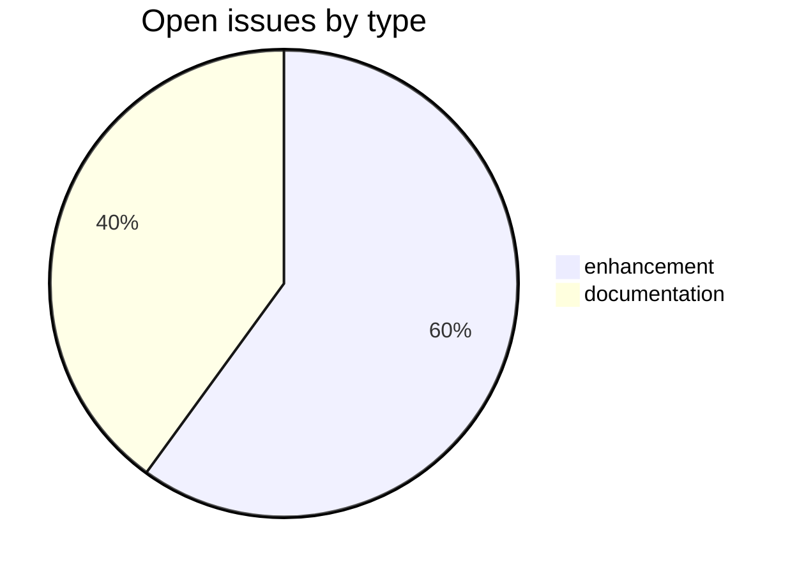
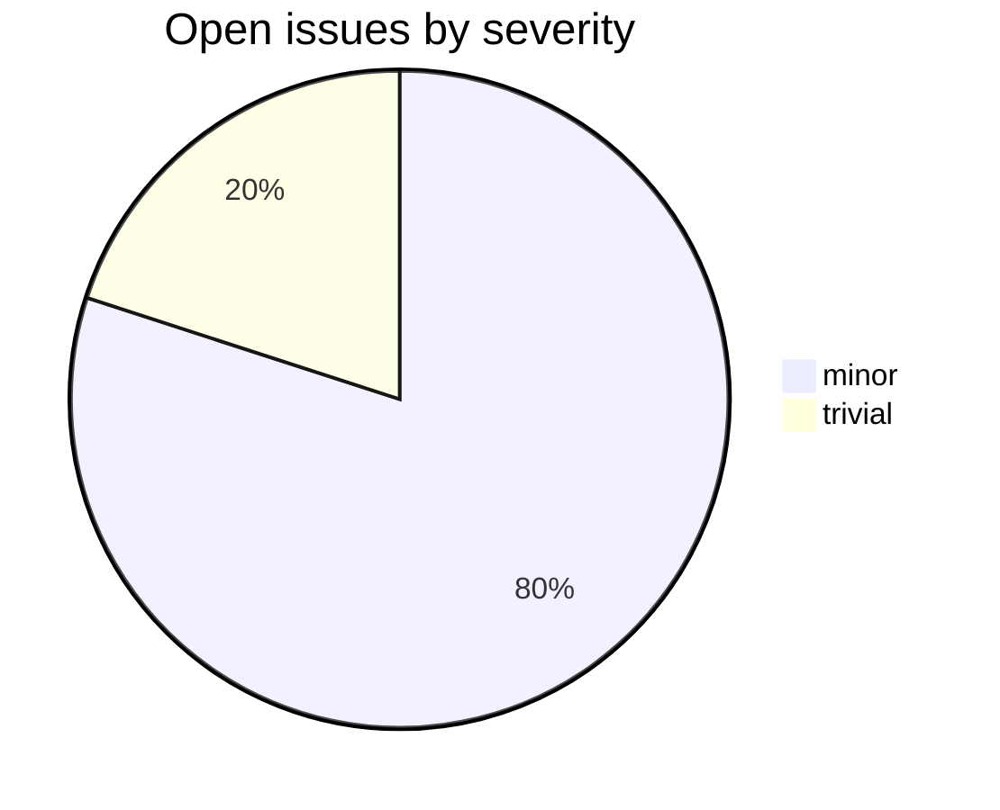

# csl-homepage

CDSL **web-frontend** repository in the Sanskrit Lexicon project.
Code that generates the homepage of http://www.sanskrit-lexicon.uni-koeln.de/

## Tech Stack

- **Runtime**: Python
- **Build**: per-repo workflow
- **Pipeline**: see [csl-observatory tooling runbook](https://github.com/sanskrit-lexicon/csl-observatory/blob/main/runbook/cologne-tooling-runbook.md)

## Issues Overview

Snapshot 2026-05-29: **5** open, **14** closed.

### By Milestone

| Milestone | Open | Closed | Total |
|---|---:|---:|---:|
| API Stability | 0 | 0 | 0 |
| User Experience | 3 | 0 | 3 |
| Data Quality | 0 | 0 | 0 |
| Developer Experience | 2 | 0 | 2 |
| Community | 0 | 0 | 0 |

### By Type

### By Severity

## GitHub Issue Conventions

Follows the [Cologne tooling-repo taxonomy](https://github.com/sanskrit-lexicon/csl-observatory/blob/main/runbook/cologne-tooling-runbook.md):

- **17 type labels** across 5 categories
- **4 severity levels**: trivial, minor, major, critical
- **5 milestones**: API Stability, User Experience, Data Quality, Developer Experience, Community
- **Domain labels** scoped to web-frontend: `domain:ui`, `domain:routing`, `domain:i18n`, `domain:rendering`
- **Org Project**: [Tooling Roadmap](https://github.com/orgs/sanskrit-lexicon/projects/9)

---
*Generated by Cologne Tooling Runbook on 2026-05-29*

## License

This repository contains both source code and dictionary/data files, which are
licensed separately:

- **Source code** (e.g. `*.py`, `*.php`, `*.js`, `*.sh`) is licensed under the
  **GNU General Public License v3.0** — see
  [`licenses/GPL-3.0.txt`](licenses/GPL-3.0.txt).
- **Dictionary and data files** are licensed under **Creative Commons
  Attribution-ShareAlike 4.0 International (CC-BY-SA-4.0)** — see
  [`LICENSE`](LICENSE).
